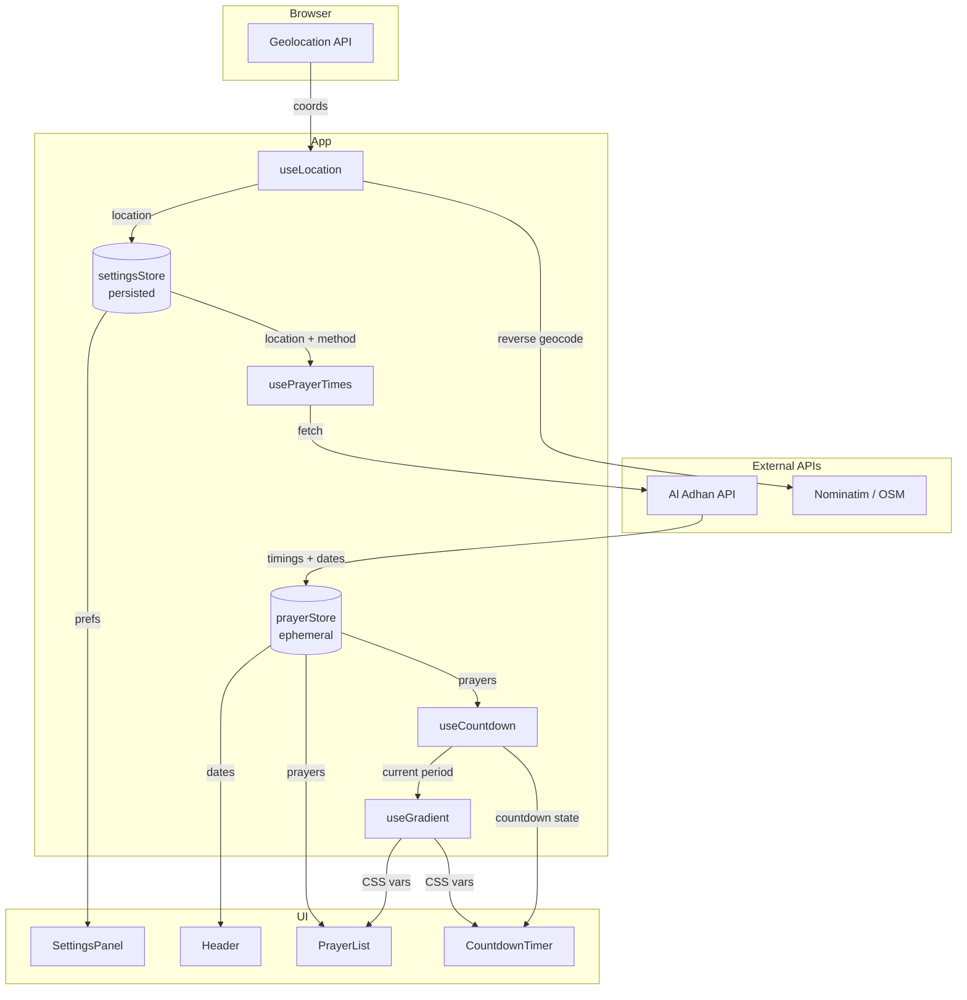
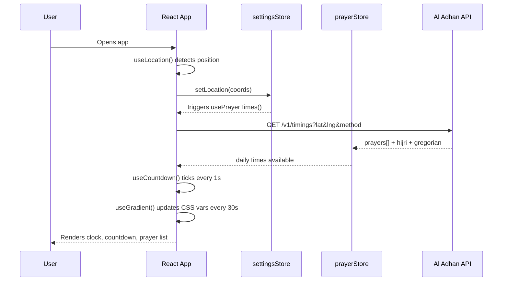
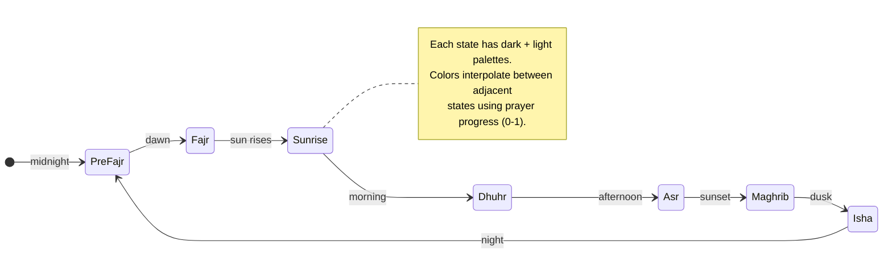

# Salat Time

A beautiful, installable prayer times PWA with ambient gradient animations that shift with each prayer period throughout the day.

**[Live Demo](https://salat-time.pages.dev)** &middot; Built with React 19 + TypeScript + Tailwind v4


---

## Features

- **Live Clock & Countdown** → real-time display of current time and countdown to the next prayer with animated digit transitions
- **Ambient Gradients** → background smoothly interpolates between 7 prayer-period color palettes, driven by CSS custom properties
- **Offline-First PWA** → service worker caches the app shell and API responses; works without internet after first load
- **Full RTL & Arabic Support** → bidirectional layout with Noto Sans Arabic, CSS logical properties, and LTR-locked numerals
- **15 Calculation Methods** → ISNA, MWL, Egyptian, Umm al-Qura, and more via the Al Adhan API
- **Hijri Date** → displays the Islamic calendar date with adjustable offset (-2 to +2 days)
- **Auto Location Detection** → uses Geolocation API + Nominatim reverse geocoding, with manual city search fallback
- **Light & Dark Themes** → each prayer period has distinct palettes for both themes
- **12h / 24h Time Format** → user-selectable, persisted across sessions

---

## Architecture



---

## Data Flow



---

## Gradient System

The hero feature → ambient gradients that follow the sun.



**How it works:**

1. `useGradient` reads the current & next prayer from the store
2. `interpolateGradient()` linearly blends two palettes based on elapsed progress
3. `applyGradientToDOM()` writes `--gradient-from/via/to` CSS custom properties
4. `.gradient-bg` in CSS picks them up with `transition: background 2s ease`

No 60fps JavaScript animation → pure CSS transitions.

---

## Project Structure

```
src/
  api/
    aladhan.ts          # Al Adhan + Nominatim API clients
  components/
    layout/
      AppShell.tsx       # Root wrapper with gradient background
      GradientBackground.tsx
      Header.tsx         # Title, Gregorian & Hijri dates, settings button
    prayer/
      CountdownTimer.tsx # Live clock + animated countdown + progress bar
      PrayerCard.tsx     # Individual prayer row with status indicators
      PrayerList.tsx     # All 6 prayers with skeleton loading
    settings/
      SettingsPanel.tsx  # Slide-over panel
      LocationSearch.tsx # City autocomplete via Nominatim
      MethodSelector.tsx # 15 calculation methods
      ...Toggle.tsx      # Theme, language, Asr school, time format
  hooks/
    useCountdown.ts      # 1s interval, calculates time remaining
    useGradient.ts       # 30s interval, interpolates & applies colors
    useLocation.ts       # Geolocation + reverse geocoding
    usePrayerTimes.ts    # Fetches on location/settings change + midnight
    useTranslation.ts    # i18n with JSON locale files
  stores/
    settingsStore.ts     # Zustand + persist (language, theme, method, etc.)
    prayerStore.ts       # Zustand ephemeral (daily times, current/next prayer)
  utils/
    calculations.ts      # Prayer period logic, method suggestions
    date.ts              # Timestamp conversion, formatting (Hijri, Gregorian)
    gradients.ts         # 7 palettes x 2 themes, interpolation, DOM application
  types/
    index.ts             # All TypeScript interfaces and type aliases
public/
  locales/
    en.json              # English translations
    ar.json              # Arabic translations
  icons/                 # PWA icons (192x192, 512x512)
```

---

## Getting Started

### Prerequisites

- [Node.js](https://nodejs.org/) 18+
- [pnpm](https://pnpm.io/) 9+

### Install & Run

```bash
pnpm install
pnpm dev
```

Open [http://localhost:5173](http://localhost:5173).

### Build

```bash
pnpm build
pnpm preview   # preview production build locally
```

Output in `dist/` (~119 KB gzipped JS).

---

## Tech Stack

| Layer     | Technology                                                                                    |
| --------- | --------------------------------------------------------------------------------------------- |
| Framework | React 19                                                                                      |
| Language  | TypeScript (strict)                                                                           |
| Styling   | Tailwind CSS v4 (CSS-first, no config file)                                                   |
| Animation | Motion (Framer Motion) 12                                                                     |
| State     | Zustand 5 with persist middleware                                                             |
| Time      | Day.js + UTC/timezone plugins                                                                 |
| PWA       | vite-plugin-pwa + Workbox                                                                     |
| Build     | Vite 6                                                                                        |
| APIs      | [Al Adhan](https://aladhan.com/prayer-times-api) &middot; [Nominatim](https://nominatim.org/) |
| Deploy    | Cloudflare Pages                                                                              |

---

## Configuration

All settings are persisted in `localStorage` under the `salat-settings` key:

| Setting            | Options                      | Default  |
| ------------------ | ---------------------------- | -------- |
| Language           | English, Arabic              | English  |
| Theme              | Dark, Light                  | Dark     |
| Time Format        | 12h, 24h                     | 24h      |
| Calculation Method | 15 methods                   | ISNA (2) |
| Asr School         | Shafi'i, Hanafi              | Shafi'i  |
| Hijri Adjustment   | -2 to +2 days                | 0        |
| Location           | Auto-detect or manual search | Auto     |

---

## Deployment

Configured for **Cloudflare Pages** with:

- `public/_redirects` → SPA fallback routing
- `public/_headers` → security and caching headers

```bash
# Deploy via Cloudflare CLI
npx wrangler pages deploy dist
```

Or connect the GitHub repo to Cloudflare Pages with build command `pnpm build`.

---

## License

[AGPL-3.0](LICENSE) -- You may use, modify, and distribute this software, but any derivative work (including running it as a network service) **must** be open-sourced under the same license.
